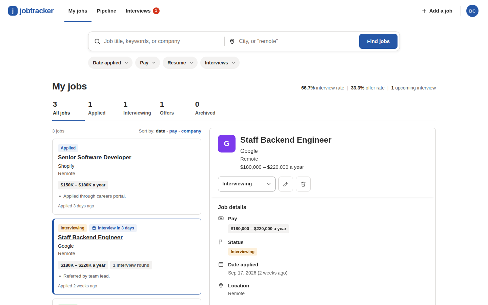
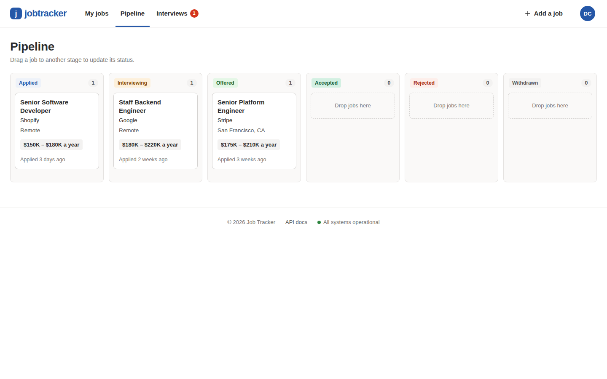
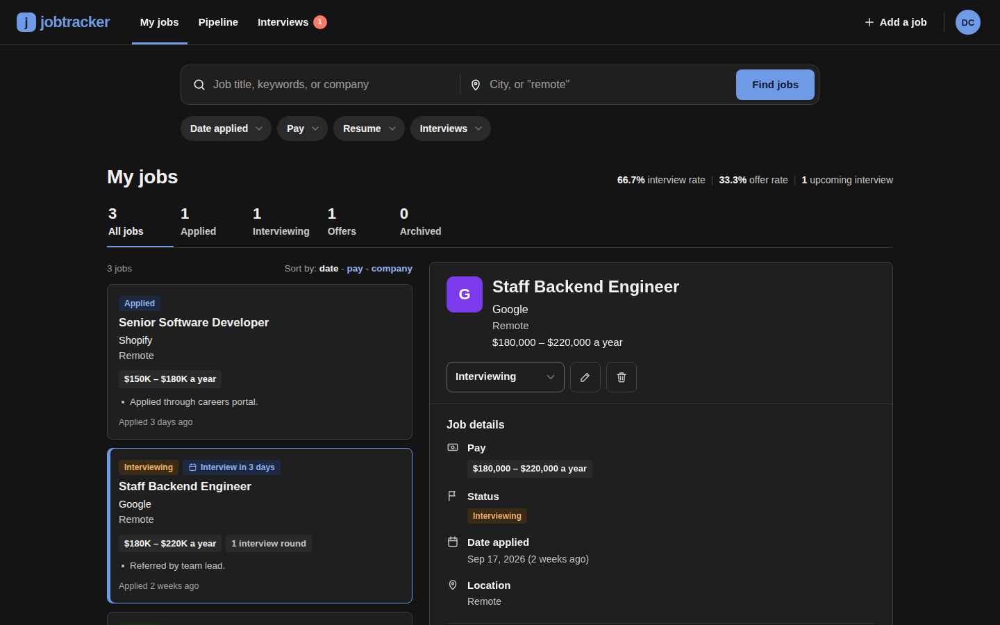
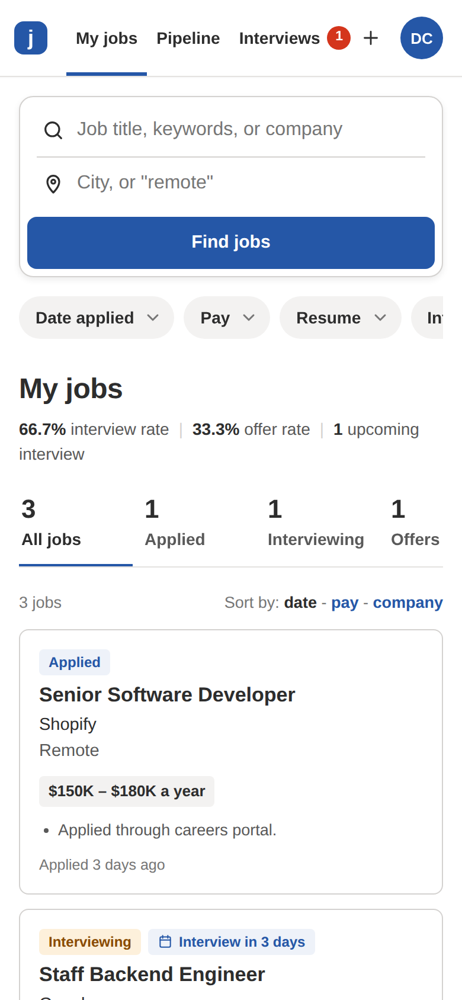
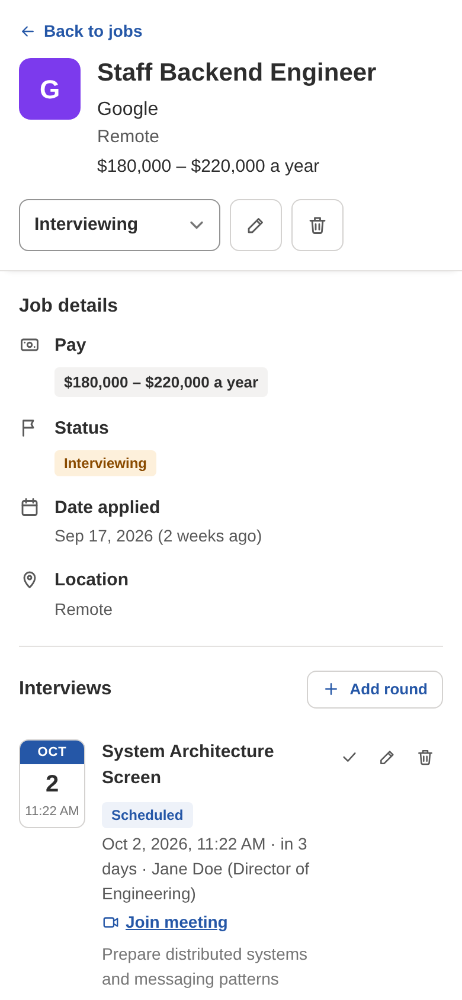

# Job Application Tracker

Track every job application from first submission to signed offer. A REST API built with **Express 5**, **Prisma Next (Prisma 8)**, **PostgreSQL** and **TypeScript**, with a built-in, dependency-free web dashboard.



## Features

**Dashboard (served at `/`)**, laid out like a job portal
- **My jobs:** a "what / where" search bar, filter pills (date applied, pay, resume, interviews), stage tabs with counts (All, Applied, Interviewing, Offers, Archived), sort by date, pay or company
- **Job cards and detail pane:** job cards on the left, with pay chips, status and "Interview in 2 days" tags and a notes snippet. Selecting one opens a sticky pane on the right with job details, a "View job posting" button, status changes, interview rounds, resume upload/download, notes and an activity timeline
- **Pipeline:** a board with drag-and-drop between the six stages
- **Interviews:** upcoming and past rounds across all jobs, with one-click "mark completed"
- **Account:** profile and settings, password change, CSV export, account deletion, sign up, sign in, forgot/reset password
- **Responsive and themed:** on phones the detail pane becomes a full-screen sheet; light and dark themes
- **Keyboard shortcuts:** `n` adds a job, `/` focuses search, ↑/↓ moves through the list
- No CDNs or build step: plain HTML/CSS/ES modules that run under a strict Content-Security-Policy

| | |
|---|---|
|  |  |
|  |  |

**API**
- JWT auth (bcrypt hashing), Helmet security headers with CSP, CORS, rate limiting
- Applications CRUD with strict per-user ownership checks and automatic status history
- Cursor pagination, case-insensitive company search, status filter
- Interview rounds, resume files (PDF/DOC/DOCX up to 5 MB), CSV export, per-user stats
- OpenAPI 3 docs with Swagger UI at `/api-docs`

## Quick start

### Option A: Docker Compose

```bash
docker compose up --build
```

Open http://localhost:3000. The `migrate` service creates the tables before the API starts. Set `JWT_SECRET` (32+ characters) in your shell or a `.env` file before deploying anywhere public.

### Option B: Local

Prerequisites: **Node.js 22+** and **PostgreSQL 15+**.

```bash
npm install
cp .env.example .env          # then edit DATABASE_URL and JWT_SECRET
npm run db:init               # create tables (safe to re-run)
npm run seed                  # optional: demo account demo@jobtracker.dev / DemoPassword123
npm run dev                   # http://localhost:3000
```

## Scripts

| Command | What it does |
|---|---|
| `npm run dev` | Start with auto-reload |
| `npm start` | Start the server |
| `npm run typecheck` | TypeScript type check (`build` is an alias) |
| `npm test` | API integration tests (needs `DATABASE_URL` pointing at a database initialised with `db:init`) |
| `npm run test:e2e` | Browser test of the dashboard (server running; `npm i --no-save playwright && npx playwright install chromium` first) |
| `npm run db:init` | Create or update database tables from the contract |
| `npm run contract:emit` | Regenerate `src/prisma/contract.json` / `contract.d.ts` after editing `contract.prisma` |
| `npm run seed` | Insert the demo account and sample data |

## Configuration

See [`.env.example`](.env.example) for every variable. The important ones:

| Variable | Required | Description |
|---|---|---|
| `DATABASE_URL` | Yes | PostgreSQL connection string |
| `JWT_SECRET` | Yes | Token signing secret (32+ chars enforced in production) |
| `JWT_EXPIRES_IN` | No | Session length, default `2h` |
| `PORT` | No | Default `3001` (the example `.env` uses `3000`) |
| `ALLOWED_ORIGIN` | No | CORS origin, default `*` |
| `ADMIN_EMAILS` | No | Comma-separated emails allowed to call `GET /admin/stats` |
| `API_RATE_LIMIT` / `AUTH_RATE_LIMIT` | No | Requests per 15 min per IP (defaults 1000 / 10 failed attempts) |
| `TRUST_PROXY` | No | Set behind a reverse proxy so rate limiting sees real client IPs |

> **Password reset email:** email delivery is simulated (`src/services/email.ts` logs the message). Outside production, `POST /auth/forgot-password` also returns a `devResetToken` so the reset flow works end-to-end in the dashboard. Hook up a real mail provider in `EmailService.sendPasswordReset` before relying on password reset in production.

## API overview

All endpoints except `/health`, `/api-docs`, signup, login, forgot/reset password require `Authorization: Bearer <token>`. Full schemas are in Swagger UI at `/api-docs`.

| Method | Endpoint | Description |
|---|---|---|
| GET | `/health` | Liveness + database check |
| POST | `/auth/signup` | Register (`email`, `password`, optional `name`) |
| POST | `/auth/login` | Get a JWT |
| GET / PATCH / DELETE | `/auth/profile` | Read, update, or delete the account (cascades all data) |
| POST | `/auth/change-password` | Change password |
| POST | `/auth/forgot-password` | Request a reset token |
| POST | `/auth/reset-password` | Reset password with a token |
| GET / POST | `/applications` | List (`limit`, `cursor`, `status`, `company`) or create |
| GET | `/applications/stats` | Per-user metrics |
| GET / PATCH / DELETE | `/applications/:id` | Read, update (`statusNote` annotates status changes), delete |
| GET | `/applications/:id/history` | Status timeline |
| GET / POST | `/applications/:id/interviews` | List or add interview rounds |
| POST / GET / DELETE | `/applications/:id/resume` | Upload (multipart field `resume`), download, remove |
| GET | `/interviews` | All interviews across applications (`?upcoming=true`) |
| GET / PATCH / DELETE | `/interviews/:id` | Read, update, delete a round |
| GET | `/export/csv` | Download all applications as CSV |
| GET | `/admin/stats` | Cross-user metrics (admins only) |

## Project structure

```
├── public/                  # Web dashboard (no build step)
│   ├── index.html           #   markup, dialogs, SVG icon sprite
│   ├── css/app.css          #   design tokens, light/dark themes, components
│   └── js/                  #   ES modules: api.js (HTTP client), ui.js (helpers), app.js (screens)
├── src/
│   ├── app.ts               # Express app: security, static files, routes, error handling
│   ├── index.ts             # Server entry point, env validation, graceful shutdown
│   ├── routes/              # auth, applications, interviews, export, admin
│   ├── middleware/          # auth (JWT), validate, upload (multer), rate limiting, errors
│   ├── prisma/              # contract.prisma (schema) + generated contract + db client
│   ├── utils/serialize.ts   # timestamp normalisation + response sanitising
│   ├── services/email.ts    # email stub
│   ├── docs/swagger.ts      # OpenAPI spec
│   └── scripts/seed.ts      # demo data
├── tests/                   # node:test API suites + Playwright e2e script
├── docs/CODEBASE_GUIDE.md   # How the code fits together
├── Dockerfile / docker-compose.yml
└── .github/workflows/ci.yml # typecheck + tests against Postgres, Docker build
```

For a walkthrough of how requests flow through the system, see [docs/CODEBASE_GUIDE.md](docs/CODEBASE_GUIDE.md).

## License

ISC
